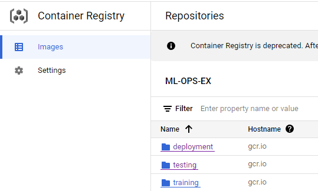

# Exam template for 02476 Machine Learning Operations

This is the report template for the exam. Please only remove the text formatted as with three dashes in front and behind
like:

```--- question 1 fill here ---```

where you instead should add your answers. Any other changes may have unwanted consequences when your report is auto
generated in the end of the course. For questions where you are asked to include images, start by adding the image to
the `figures` subfolder (please only use `.png`, `.jpg` or `.jpeg`) and then add the following code in your answer:

```markdown

```

In addition to this markdown file, we also provide the `report.py` script that provides two utility functions:

Running:

```bash
python report.py html
```

will generate an `.html` page of your report. After deadline for answering this template, we will autoscrape
everything in this `reports` folder and then use this utility to generate an `.html` page that will be your serve
as your final handin.

Running

```bash
python report.py check
```

will check your answers in this template against the constrains listed for each question e.g. is your answer too
short, too long, have you included an image when asked to.

For both functions to work it is important that you do not rename anything. The script have two dependencies that can
be installed with `pip install click markdown`.

## Overall project checklist

The checklist is *exhaustic* which means that it includes everything that you could possible do on the project in
relation the curricilum in this course. Therefore, we do not expect at all that you have checked of all boxes at the
end of the project.

### Week 1

* [x] Create a git repository
* [x] Make sure that all team members have write access to the github repository
* [x] Create a dedicated environment for you project to keep track of your packages
* [x] Create the initial file structure using cookiecutter
* [x] Fill out the `make_dataset.py` file such that it downloads whatever data you need and
* [x] Add a model file and a training script and get that running
* [x] Remember to fill out the `requirements.txt` file with whatever dependencies that you are using
* [x] Remember to comply with good coding practices (`pep8`) while doing the project
* [x] Do a bit of code typing and remember to document essential parts of your code
* [x] Setup version control for your data or part of your data
* [x] Construct one or multiple docker files for your code
* [x] Build the docker files locally and make sure they work as intended
* [x] Write one or multiple configurations files for your experiments
* [x] Used Hydra to load the configurations and manage your hyperparameters
* [x] When you have something that works somewhat, remember at some point to to some profiling and see if
      you can optimize your code
* [x] Use Weights & Biases to log training progress and other important metrics/artifacts in your code. Additionally,
      consider running a hyperparameter optimization sweep.
* [x] Use Pytorch-lightning (if applicable) to reduce the amount of boilerplate in your code

### Week 2

* [x] Write unit tests related to the data part of your code
* [x] Write unit tests related to model construction and or model training
* [x] Calculate the coverage.
* [x] Get some continuous integration running on the github repository
* [x] Create a data storage in GCP Bucket for you data and preferable link this with your data version control setup
* [x] Create a trigger workflow for automatically building your docker images
* [~] Get your model training in GCP using either the Engine or Vertex AI
* [x] Create a FastAPI application that can do inference using your model
* [ ] If applicable, consider deploying the model locally using torchserve
* [x] Deploy your model in GCP using either Functions or Run as the backend

### Week 3

* [ ] Check how robust your model is towards data drifting
* [ ] Setup monitoring for the system telemetry of your deployed model
* [ ] Setup monitoring for the performance of your deployed model
* [ ] If applicable, play around with distributed data loading
* [ ] If applicable, play around with distributed model training
* [ ] Play around with quantization, compilation and pruning for you trained models to increase inference speed

### Additional

* [x] Revisit your initial project description. Did the project turn out as you wanted?
* [x] Make sure all group members have a understanding about all parts of the project
* [x] Uploaded all your code to github

## Group information

### Question 1
> **Enter the group number you signed up on <learn.inside.dtu.dk>**
>
> Answer:

We are Group 28.

### Question 2
> **Enter the study number for each member in the group**
>
> Example:
>
> *sXXXXXX, sXXXXXX, sXXXXXX*
>
> Answer:

s201758, s230243, s232457, s223407, s230234

### Question 3
> **What framework did you choose to work with and did it help you complete the project?**
>
> Answer length: 100-200 words.
>
> Example:
> *We used the third-party framework ... in our project. We used functionality ... and functionality ... from the*
> *package to do ... and ... in our project*.
>
> Answer:

In our project we used the pytorch framework complemented with pytorch-lightning to remove redundant boilerplate by using their pre-defined training loops. We used Weights and Biases for logging and storing the hyperparameters and metrics of all our training runs together online. Hydra was used for making a config file to control and keep track of all these hyperparameters. For data version control we used DVC, with remote storage set up in google cloud. This was also useful to be able to pull the data from GitHub for running unit tests with each push via the GitHub actions that we set up.

## Coding environment

> In the following section we are interested in learning more about you local development environment.

### Question 4

> **Explain how you managed dependencies in your project? Explain the process a new team member would have to go**
> **through to get an exact copy of your environment.**
>
> Answer length: 100-200 words
>
> Example:
> *We used ... for managing our dependencies. The list of dependencies was auto-generated using ... . To get a*
> *complete copy of our development environment, one would have to run the following commands*
>
> Answer:

Throughout our development process, we have manually maintained 'requirements.txt' and 'requirements_dev.txt' files, updating them each time we introduced new modules or libraries. This being said, the pipreqs library could also be used to obtain the contents of both files in a single requirements file with the command 'pipreqs .', which scans the project's dependencies instead of taking all of the installed ones in the environment as pip freeze would do. However, this means that users will also have to install development libraries not necessary for running the project. To get a complete version of our development environment, one would just need to run 'pip install -r requirements.txt' and then 'pip install -r requirements_dev.txt'.

### Question 5

> **We expect that you initialized your project using the cookiecutter template. Explain the overall structure of your**
> **code. Did you fill out every folder or only a subset?**
>
> Answer length: 100-200 words
>
> Example:
> *From the cookiecutter template we have filled out the ... , ... and ... folder. We have removed the ... folder*
> *because we did not use any ... in our project. We have added an ... folder that contains ... for running our*
> *experiments.*
> Answer:

We have tried to follow the cookiecutter template and use it as the mainframe for our project. However, we have also implemented some new files to improve our workflow. For example, for docker we have created a separate folder that stores our docker files and the cloudbuild.yaml that makes the trigger event possible from the cloud. During implementing dvc we have also got files created regarding its set up like ".dvc" which has the config file, and data.dvc which defines the files from the data folder we wish to upload. Also our main data folder got located in the root in which we store our predictions, raw data, processed data etc. The original data folder from the template that is one level downer has our make_dataset.py which is going to produce our processed data from raw. We also added our reports folder in the root. When we are running the training of our model new folders are also appearing that are going to store the data from wandb.

### Question 6

> **Did you implement any rules for code quality and format? Additionally, explain with your own words why these**
> **concepts matters in larger projects.**
>
> Answer length: 50-100 words.
>
> Answer:

For code quality we have implemented a totla of 23 unit tests through the pytest framework. For code format we have complied with the PEP8 style guide, to ensure the commitment of the code with the standar we have implemented ruff in the precommit file and the ghithub actions run when doing pull requests to the main branch.

## Version control

> In the following section we are interested in how version control was used in your project during development to
> corporate and increase the quality of your code.

### Question 7

> **How many tests did you implement and what are they testing in your code?**
>
> Answer length: 50-100 words.
>
> Example:
> *In total we have implemented X tests. Primarily we are testing ... and ... as these the most critical parts of our*
> *application but also ... .*
>
> Answer:

In total we have implemented 21 tests over 3 testing files. These all make sure that the main scripts and functions in the project work correctly. Namely, we have a 'data_test.py' that tests the data processing from the 'make_dataset.py' script, a 'model_test.py' which tests the auxiliary of the  model class (like accuracy), and a 'predict_test.py' which tests that our prediction script works correctly on all the supported input types.

### Question 8

> **What is the total code coverage (in percentage) of your code? If you code had an code coverage of 100% (or close**
> **to), would you still trust it to be error free? Explain you reasoning.**
>
> Answer length: 100-200 words.
>
> Example:
> *The total code coverage of code is X%, which includes all our source code. We are far from 100% coverage of our **
> **
>
> Answer:

The total code coverage of code is 72%, which includes all our source code which is all under the patch_camelyon_2024_mlops_g28 folder. We are relatively far from 100% coverage on our code and even if we were then there could still be problems that are not adressed as unit testing is only one out of many testing types. For instance it could be relevant for an automated project such as ours to implement integration and deployment tests, also given the ML nature of the project it could be interesting to make some ML specific tests that ensure the training process performs as expected.

### Question 9

> **Did you workflow include using branches and pull requests? If yes, explain how. If not, explain how branches and**
> **pull request can help improve version control.**
>
> Answer length: 100-200 words.
>
> Example:
> *We made use of both branches and PRs in our project. In our group, each member had an branch that they worked on in*
> *addition to the main branch. To merge code we ...*
>
> Answer:

--- question 9 fill here ---

### Question 10

> **Did you use DVC for managing data in your project? If yes, then how did it improve your project to have version**
> **control of your data. If no, explain a case where it would be beneficial to have version control of your data.**
>
> Answer length: 100-200 words.
>
> Example:
> *We did make use of DVC in the following way: ... . In the end it helped us in ... for controlling ... part of our*
> *pipeline*
>
> Answer:

--- question 10 fill here ---

### Question 11

> **Discuss your continues integration setup. What kind of CI are you running (unittesting, linting, etc.)? Do you test**
> **multiple operating systems, python version etc. Do you make use of caching? Feel free to insert a link to one of**
> **your github actions workflow.**
>
> Answer length: 200-300 words.
>
> Example:
> *We have organized our CI into 3 separate files: one for doing ..., one for running ... testing and one for running*
> *... . In particular for our ..., we used ... .An example of a triggered workflow can be seen here: <weblink>*
>
> Answer:

We have organized our CI into 1 single file, .github/workflows/main_flow.yml, which builds three virtual machine with the three most common operating systems (windows, macos and ubuntu latest releases), build our python version of choice on them (3.8), installs the requiered dependencies through pip and our requirements.txt file, authenticates to a service account on our google cloud projects, for this porpouse we generated a guithub secret with the key to service account, and through data version control gets the raw data files from a data bucket on the google cloud project, finally the workflow runs the implemented unit tests, or skips them as some tests we decided to run exclusively on local to save on resources from the github actions servers, and runs lint through ruff on the whole code to double check that it adjusts to the PEP8 guidelines, automatically making any requiered modifications to it. Originaly the dvc system was not localted in a cloud data bucket but rather on google drive and the number of tests has increased during time so that explains why the fisrt runs of the workflow are different from the last ones.
The workflow also includes the cache system that individually stores generates a cache file for each of the operating systems including both dependencies and data files within it to improve the performance of the future runs.
For our project an example of a triggered workflow can be seen here: <https://github.com/Frostforus/Patch_Camelyon_2024_MLOPS_G28/actions/runs/7584267424>*

## Running code and tracking experiments

> In the following section we are interested in learning more about the experimental setup for running your code and
> especially the reproducibility of your experiments.

### Question 12

> **How did you configure experiments? Did you make use of config files? Explain with coding examples of how you would**
> **run a experiment.**
>
> Answer length: 50-100 words.
>
> Example:
> *We used a simple argparser, that worked in the following way: python my_script.py --lr 1e-3 --batch_size 25*
>
> Answer:

--- question 12 fill here ---

### Question 13

> **Reproducibility of experiments are important. Related to the last question, how did you secure that no information**
> **is lost when running experiments and that your experiments are reproducible?**
>
> Answer length: 100-200 words.
>
> Example:
> *We made use of config files. Whenever an experiment is run the following happens: ... . To reproduce an experiment*
> *one would have to do ...*
>
> Answer:

First of all, all hyperparameters used in training are entered through a Hydra configuration file, which automatically logs the parameters of each run. Aditionally, we pass all of these parameters to the Weights and Biases logger, so we also have these tied to the specific run metrics online, this way we know what parameters yielded what results. To ensure reproducibility when running with the same hyperparameters, we set a fixed seed for pytorch before generating the model, ensuring the same initial weights in each run. We also used the same seeding technique to always get the same dataset split when generating the processed dataset.

### Question 14

> **Upload 1 to 3 screenshots that show the experiments that you have done in W&B (or another experiment tracking**
> **service of your choice). This may include loss graphs, logged images, hyperparameter sweeps etc. You can take**
> **inspiration from [this figure](figures/wandb.png). Explain what metrics you are tracking and why they are**
> **important.**
>
> Answer length: 200-300 words + 1 to 3 screenshots.
>
> Example:
> *As seen in the first image when have tracked ... and ... which both inform us about ... in our experiments.*
> *As seen in the second image we are also tracking ... and ...*
>
> Answer:


As seen in the first image, when we train a model, all of the used hyperparameters of the model (seed), dataloaders (batch size) trainer (learning rate, accumulated gradient batches, fraction of dataset used...) are uploaded to Weights and Biases into a new run's overview page. Here we can also see the overall results/metrics of the model when it finished training: Accuracy and loss over the training and validation sets and the number of epochs and steps taken.

In the second image, we can see a more interesting view of how the training proceeded for the run. In this case we can see three manually generated graphs displaying the accuracy, loss and average accuracy per epoch of both the train and validation datasets in relation to the training steps or epochs. Below these are some other automatically generated graphs that are not visible in the screenshot. These give us a lot of insight on how the training went so that we can improve future models and hyperparameters: we can see if there is overfitting to the training set, if training stabilized, if there is a lot of fluctuation between epochs...

Finally, we can see that after training is finished, the model checkpoint is also uploaded to Weights and Biases and tied to the run. This is great to be able to fall back on a model for which you know the results and metrics of, and even compare it to another run with the same parameters.

### Question 15

> **Docker is an important tool for creating containerized applications. Explain how you used docker in your**
> **experiments? Include how you would run your docker images and include a link to one of your docker files.**
>
> Answer length: 100-200 words.
>
> Example:
> *For our project we developed several images: one for training, inference and deployment. For example to run the*
> *training docker image: `docker run trainer:latest lr=1e-3 batch_size=64`. Link to docker file: <weblink>*
>
> Answer:


Docker was vital in this project as some of the training code and all of the backend was containerized, so that it could be deployed to cloud run.
All of our dockerfiles can be found in the /dockerfiles/ directory.
Regarding the server, we used a dockerfile to build the image, and then pushed it to the google cloud container registry, from where it was pulled and deployed to cloud run.
This helped make sure that the server was always running the same code, and that it was easy to update it.
Implementing the CI/CD pipeline was also made easier by using docker, as we could just build the image and push it to the registry, and then deploy it to cloud run.

### Question 16

> **When running into bugs while trying to run your experiments, how did you perform debugging? Additionally, did you**
> **try to profile your code or do you think it is already perfect?**
>
> Answer length: 100-200 words.
>
> Example:
> *Debugging method was dependent on group member. Some just used ... and others used ... . We did a single profiling*
> *run of our main code at some point that showed ...*
>
> Answer:

Initially our first approach was running the file with the error after printing any relevant information to the terminal, making some fixes and kept executing it this way until the problem was solved. While simple and intuitive this process proved to be slow and ineficient, and also carried the risk of leaving innecesary print statements on the code that could hinder the loggings and increase execution times, so taking into consideration that we all decided on using the Visual Studio Code interpreter we ended up opting for debugging the code through the use of it's built in debugger.
For profiling we implemented the profiling.py file in wich we assesed the performance of the bigger functions through torch´s profiler app.
The profiling stores the information for both GPU(only when available) and CPU, as well as storage (althou this proved to be useless given that we do not implement torch´s DataLoader class). We did find that our loading of the data is a botlle neck in resourcess and thought of tring to parallelizing this process but did not have time to implement this.

## Working in the cloud

> In the following section we would like to know more about your experience when developing in the cloud.

### Question 17

> **List all the GCP services that you made use of in your project and shortly explain what each service does?**
>
> Answer length: 50-200 words.
>
> Example:
> *We used the following two services: Engine and Bucket. Engine is used for... and Bucket is used for...*
>
> Answer:


We used the following services: Cloud Storage, Container Registry, Secret Manager, Cloud Build and Cloud Run.  
We used Cloud storage to store our data and models. We used Container Registry to store our docker images. We used Secret Manager to store our credentials to the gbucket, and ultimately be able to use these secrets in our docker containers. We used Cloud Build to build our docker images, and deploy them to the cloud run instance. We used Cloud Run to deploy our backend prediction server.


### Question 18

> **The backbone of GCP is the Compute engine. Explained how you made use of this service and what type of VMs**
> **you used?**
>
> Answer length: 100-200 words.
>
> Example:
> *We used the compute engine to run our ... . We used instances with the following hardware: ... and we started the*
> *using a custom container: ...*
>
> Answer:

We used cloud engine to run the training of our models. We used the following hardware: n1-standard-4 (4 vCPUs, 15 GB memory). 
However sadly the final training couldn't be run on this due to a lack of credits

### Question 19

> **Insert 1-2 images of your GCP bucket, such that we can see what data you have stored in it.**
> **You can take inspiration from [this figure](figures/bucket.png).**
>
> Answer:
We used two buckets:

The first one is used to store our data.

The second one is used to store our models.


### Question 20

> **Upload one image of your GCP container registry, such that we can see the different images that you have stored.**
> **You can take inspiration from [this figure](figures/registry.png).**
>
> Answer:





### Question 21

> **Upload one image of your GCP cloud build history, so we can see the history of the images that have been build in**
> **your project. You can take inspiration from [this figure](figures/build.png).**
>
> Answer:


### Question 22

> **Did you manage to deploy your model, either in locally or cloud? If not, describe why. If yes, describe how and**
> **preferably how you invoke your deployed service?**
>
> Answer length: 100-200 words.
>
> Example:
> *For deployment we wrapped our model into application using ... . We first tried locally serving the model, which*
> *worked. Afterwards we deployed it in the cloud, using ... . To invoke the service an user would call*
> *`curl -X POST -F "file=@file.json"<weburl>`*
>
> Answer:

Yes we could deploy our model to the cloud. By hosting our fastapi server with the cloud run service. We had some issues with this as GCP always had one more problem in each step when we fixed something, as evident from the build history.
In the end we managed to create a server which can be invoked by sending a post request with the image, which in turn returns a prediction fro the picture. 
The frontend however that we host on the githubpages doesn't work because of some cors error, and a new insecure error, as it complains about the requested url being served over http, instead of https, however we couldn't find a way to fix this.

### Question 23

> **Did you manage to implement monitoring of your deployed model? If yes, explain how it works. If not, explain how**
> **monitoring would help the longevity of your application.**
>
> Answer length: 100-200 words.
>
> Example:
> *We did not manage to implement monitoring. We would like to have monitoring implemented such that over time we could*
> *measure ... and ... that would inform us about this ... behaviour of our application.*
>
> Answer:

--- question 23 fill here ---

### Question 24

> **How many credits did you end up using during the project and what service was most expensive?**
>
> Answer length: 25-100 words.
>
> Example:
> *Group member 1 used ..., Group member 2 used ..., in total ... credits was spend during development. The service*
> *costing the most was ... due to ...*
>
> Answer:


We have used quite many as one of our group members ran out of his initial 50 free credits. As we looked into the reason behind we saw that data storage used lots of credit where we still did not find out the exact reason. What we saw, was that one day we had very extensive data loads periodically so maybe we forgot to turn off in our training file to upload always the data and model after each run. And as we debugged a lot, probably after each run it used cloud to upload the data. 


## Overall discussion of project

> In the following section we would like you to think about the general structure of your project.

### Question 25

> **Include a figure that describes the overall architecture of your system and what services that you make use of.**
> **You can take inspiration from [this figure](figures/overview.png). Additionally in your own words, explain the**
> **overall steps in figure.**
>
> Answer length: 200-400 words
>
> Example:
>
> *The starting point of the diagram is our local setup, where we integrated ... and ... and ... into our code.*
> *Whenever we commit code and push to github, it auto triggers ... and ... . From there the diagram shows ...*
>
> Answer:


### Question 26

> **Discuss the overall struggles of the project. Where did you spend most time and what did you do to overcome these**
> **challenges?**
>
> Answer length: 200-400 words.
>
> Example:
> *The biggest challenges in the project was using ... tool to do ... . The reason for this was ...*
>
> Answer:

With the project for some of us, it was already a struggle to use git and all the version-controlling software properly. In the last days, we started having also difficulties with dvc which worked perfectly fine locally but git was having issues regarding loading the data. Also deploying our model and making it easier and reproducible turned out challenging. In the previous courses, we got used to create a project and code that we understand perfectly and we are ready to hand in which got accepted by our professor but after the course finished nobody will use it or maybe it will not be even reproducible. Personally (Bence) I felt that when I am stuck with an issue and I start debugging I can go much in the attempting direction that can be very hard to implement in version control systems like git with commits, as it can be hard to explain and document every step that was meant to trying and debugging. Also, git is an amazing program to make group work easier and traceable, but it also became sometimes quite challenging to keep up a constant development in which we only include effective and perfectly working codes. All in all, it was still very good experience to improve our skills to create a reproducible
environment.

### Question 27

> **State the individual contributions of each team member. This is required information from DTU, because we need to**
> **make sure all members contributed actively to the project**
>
> Answer length: 50-200 words.
>
> Example:
> *Student sXXXXXX was in charge of developing of setting up the initial cookie cutter project and developing of the*
> *docker containers for training our applications.*
> *Student sXXXXXX was in charge of training our models in the cloud and deploying them afterwards.*
> *All members contributed to code by...*
>
> Answer:

-Student s201758 was in charge of making the config file and its implementation. Also he made the docker images with its trigger in the cloud to create a docker everytime a push to the main happens. Also worked on data bucket set up like for model saving, docker iages load etc.
-Student s230243
-Student s232457
-Student s223407 was in charge of setting up the model and training via pytorch and lightning as well as the train logging with WandB. Additionally helped with other tasks such as building docker images, setting up hydra config files, unit testing and triggers/actions.
-Student s230234
